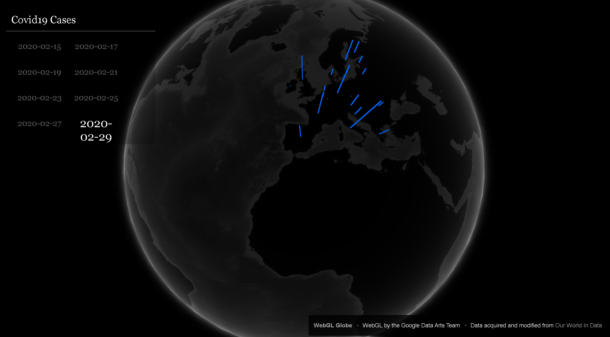
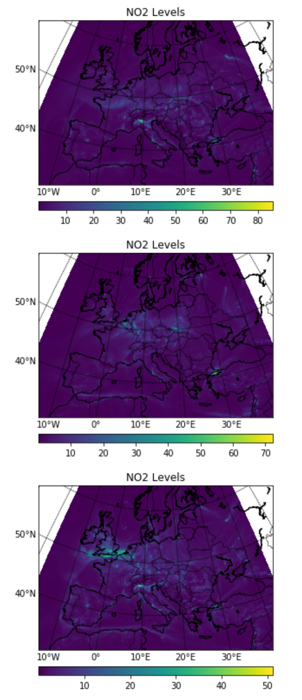
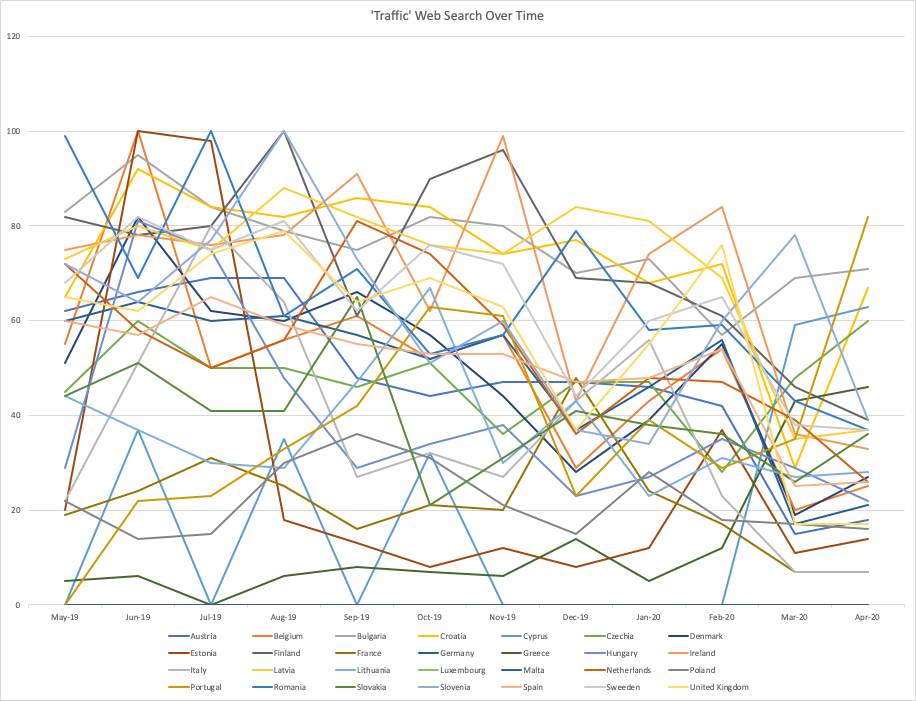

Project Collaborators -  Ben Robertson, Michaela Mason and Owen Saunders

# Viewing the globe
---------------------

After cloning the repository, you can view the WebGL globe locally using a python installation by running `python -m http.server` from the project directory and opening `localhost:8000` in your web browser. 

# NO2 and Carbon Emissions
--------------------------
The hackathon project intended to use emission grid images as backgrounds on the globe for simplistic data visualisation. Time constraints left this section half finished. Current progress is shown in the Data Manipulation notebook.

# Traffic Web Searching
------------------------
Analysis of the frequency of the search term 'Traffic' in multiple different languages was also performed. The dataset is attached and was generated from Google Trends data. Below image shows the results over the last few months.

# About **WebGL Globe**
---------------------

**The WebGL Globe** documentation and source can be found [here](https://github.com/dataarts/webgl-globe). 
`webgl-globe` uses the [Three.js library](https://github.com/mrdoob/three.js/).
